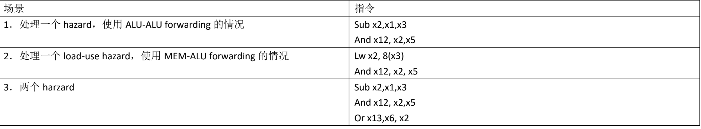
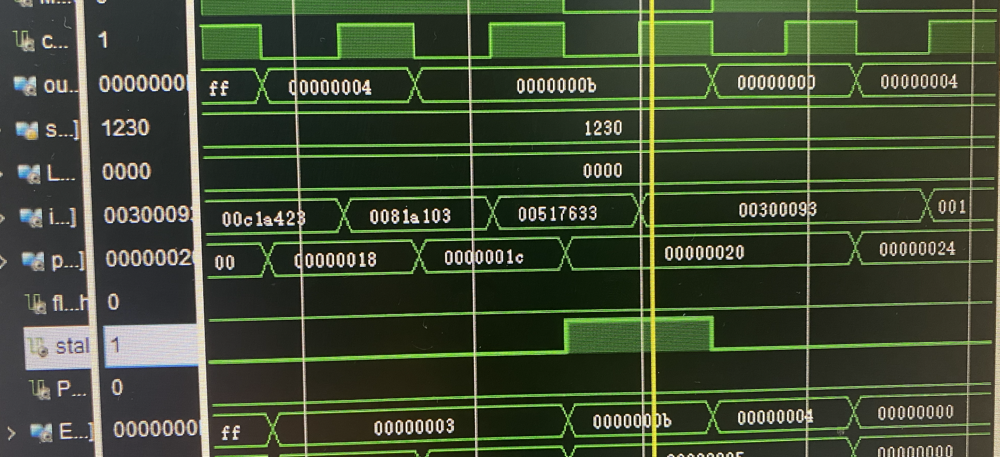
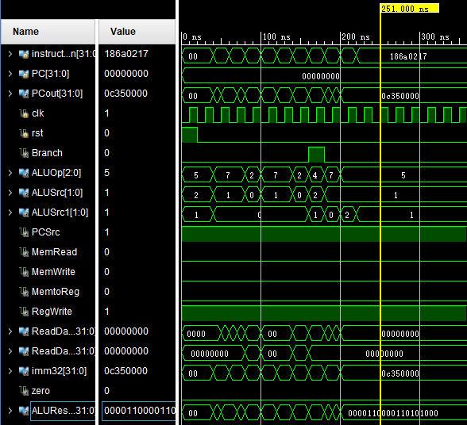

## Pipeline

### 设计思路

本项目中的pipeline设计思路参考了课件的五级流水线架构，时钟频率设计为23MHz，每个独立的模块在时钟跳变沿开始执行新的任务，各自保留一定的独立性。

对于pipeline的设计，主要有两个重要的组成部分：

- 数据转发
- Hazards处理

#### 1. 数据转发

##### 1.1 数据在模块之间的转发

在时钟跳变沿时，对于pipeline相邻的两个模块，上一个模块的输出会更新，因此，在下一个模块之中，我们需要使用寄存器来保存上一个模块在上一个时钟周期的输出。对此，我们在各个模块中都有使用寄存器，来保存上一个周期的信号，并传递到下一个模块当中，我们使用如下代码将上一阶段的信号在时钟跳变沿时储存在下一模块之中：

```verilog
always@(negedge clk, posedge rst)begin
        if(rst||flush)begin
            Ex_MemtoReg<=1'b0;
            Ex_RegWrite<=1'b0;
            EX_sign <= 1'b0;
            EX_length <= 2'b00;
            EX_MemWrite <= 1'b0;
            EX_MemRead <= 1'b0;
            EX_WriteReg <= 5'd0;
            EX_ReadData2 <= 32'd0;
        end
        else begin
            if(!stall)begin
               Ex_MemtoReg<=MemtoReg;
               Ex_RegWrite<=RegWrite; 
               EX_length <= ID_length;
               EX_sign <= ID_sign;
               EX_MemWrite <= ID_MemWrite;
               EX_MemRead <= ID_MemRead;
               EX_WriteReg <= ID_WriteReg;
               EX_ReadData2 <= in_ReadData2;
            end
        end
    end
```

这是一段ALU模块的代码，他将从ID阶段传来的信号如ID_length，ID_sign存在ALU的寄存器之中，又将这些寄存器作为输出传递到下一个模块之中，实现了信号在不同周期的保存。

```verilog
module ALU(
    input clk,
    input rst,
    input stall,
    input flush,
    input MemtoReg,
    input RegWrite,
    input [1:0] ID_length,//0 for b, 1 for h, 2 for w
    input ID_sign,
    input [4:0]ID_WriteReg,
    input[`REGWIDTH-1:0] in_PCin,
    input[1:0] in_ALUSrc,
    input[1:0] in_ALUSrc1,
    input in_PCSrc,
    input[`ALUOPWIDTH-1:0] in_ALUOp,
    input[2:0] in_funct3,
    input[6:0] in_funct7,
    input[`REGWIDTH-1:0] in_ReadData1,
    input[`REGWIDTH-1:0] in_ReadData2,
    input[`REGWIDTH-1:0] in_imm32,
    input ID_MemWrite,
    input ID_MemRead,
    output zero,
    output[`REGWIDTH-1:0] ALUResult,
    output[`REGWIDTH-1:0] PCout,
    
    output reg Ex_MemtoReg,
    output reg Ex_RegWrite,
    output reg EX_sign,
    output reg EX_MemWrite,
    output reg EX_MemRead,
    output reg[1:0] EX_length,
    output EX_flush,
    output reg[4:0] EX_WriteReg,
    output reg[31:0] EX_ReadData2,
    output PCsel
);
```

##### 1.2 Forwarding

仅仅在相邻两个模块之中传递信号是不足够的，当遇到如data hazard等情况的时候我们需要模块Forwarding来将信号跨模块传递，例如从上一个时钟周期的ALU输出传到下一个周期的ALU。如下是我们Forward模块的代码部分：

```verilog

module Forward(
input[4:0] rs1,
input[4:0] rs2,
input[4:0] W_rd,

input[4:0] preprerd,
input[4:0] prerd,
input[4:0] EX_rd,
input W_RegWrite,
input W_MemtoReg,
input M_RegWrite,
input M_MemtoReg,
input EX_RegWrite,
input EX_MemtoReg,
input[31:0] prepreMemDout,
input[31:0] prepreALUResult,
input[31:0] preMemDout,
input[31:0] preALUResult,
input[31:0] ALUResult,
output reg forward1,forward2,
output reg[31:0] forwarddata1,
output reg[31:0] forwarddata2,
output reg stall,
output reg flush
    );
    always @(*)begin
        if(EX_MemtoReg&&(EX_rd==rs1||EX_rd==rs2)&&prerd!=5'b00000)begin
            stall = 1'b1;
            flush = 1'b1;
        end
        else begin
            stall = 1'b0;
            flush = 1'b0;
        end
        forwarddata1 = 32'd0;
        forwarddata2 = 32'd0;
        forward1 = 1'b0;
        forward2 = 1'b0;

        if(M_RegWrite && prerd != 5'b00000 && (rs1 == prerd || rs2 == prerd)) begin
            if(rs1 == prerd) 
            begin 
            forwarddata1 =
            (M_MemtoReg == 1 ? preMemDout : prepreALUResult); forward1= 1; 
            end 
            if(rs2 == prerd) begin 
            forwarddata2 =(M_MemtoReg == 1 ? preMemDout : prepreALUResult); forward2= 1; 
            end
        end
        if(EX_RegWrite && EX_rd!= 5'b00000 && (rs1 == EX_rd || rs2 == EX_rd))begin
            if(rs1 == EX_rd) begin forwarddata1 =(ALUResult); forward1= 1; end 
            if(rs2 == EX_rd) begin forwarddata2 =(ALUResult); forward2= 1; end
        end
 
    end
endmodule
```

当遇到datahazard时，我们通过hazard的类型，来判断需要选择什么类型的数据来进行forwarding，并产生一个forward信号，传递到ALU之中分选信号（分选ReadData和Forwarddata）。

#### 2. Hazards处理

##### 2.1 Control hazard & Structure hazard

对于这两种hazards，由于我们设定了cpu在时钟上升沿时做写操作，在下降沿时进行读操作，不会产生对同一资源需求的情况。

##### 2.2 Data hazard

如上述的Forward模块代码，我们会通过ID解析的寄存器来判断当前的hazard类型，比如

```
M_RegWrite && prerd != 5'b00000 && (rs1 == prerd || rs2 == prerd)
```

能够判断下一个指令的所用寄存器是否需要依赖上一条指令的输出结果。如果遇到了data hazard，我们会运用这个数据转发模块来减少nop的次数。对于LOAD-USE类型的datahazard 需要输出stall信号和flush信号，将ALU中的预算结果清空，并且停止IF,ID模块的工作，让PC保留为当前的PC，直到一个周期后数据成功从DMA中加载出来后我们才继续向下执行指令。

### 测试

由于我们先开发好了single cycle的cpu，各个模块都能正常运行，在进行了pipeline的升级之后，我们只需要测试pipeline确定其不会出现hazard时的问题。我们采用了如下几个涉及data hazard测试场景对我们的pipeline架构进行设计。



由于需要确定cpu在某个特定模块是否有stall，且stall的时钟周期是否正确，我们写了一个simulation文件进行模拟，对cpu的执行过程进行细致分析。

```verilog
`timescale 1ns / 1ps
`include "variables.vh"
`include "ALUvariables.vh"
module TOPtestcs101tb();
wire forward1;
wire forward2;
reg rst;
reg clk;
wire[4:0] ID_WriteReg;
wire[4:0] EX_WriteReg;
wire[4:0] M_WriteReg;
wire[`REGWIDTH-1:0] PCout;
wire[31:0] ID_PC;
wire[31:0] M_Dout;
wire M_MemtoReg;
wire M_RegWrite;
wire cpu_clk;
wire[31:0] out;
reg[15:0] switches;
wire[15:0] LED;
wire[31:0] inst;
wire[31:0] pc;
wire flush;wire stall;wire PCsel;
wire[31:0] EX_Data1;
wire[31:0] EX_Data2;
wire[31:0] forwarddata1;
wire[31:0] forwarddata2;
wire[4:0] ReadReg1;
wire[4:0] ReadReg2;
wire[`ALUOPWIDTH-1:0] ID_ALUOp;
wire[`ALUSRCWIDTH-1:0] ID_ALUSrc;
wire[`ALUSRCWIDTH-1:0] ID_ALUSrc1;
wire flushEX;
wire [31:0] imm;
wire[31:0] ReadData1;
wire[31:0] ReadData2;
wire preRegWrite;
reg button;
wire[4:0] W_rd;
wire [31:0] W_Dout;
wire ID_MemtoReg;
wire EX_MemtoReg;
TOP top(clk,rst,switches,button,W_rd,W_Dout,ID_MemtoReg,EX_MemtoReg,M_MemtoReg,M_RegWrite,preRegWrite,ID_PC,M_Dout,PCout, ID_WriteReg,EX_WriteReg,M_WriteReg,forward1,forward2,ReadData1,ReadData2,imm,flushEX,ID_ALUOp,ID_ALUSrc,ID_ALUSrc1,ReadReg1,ReadReg2,forwarddata1,forwarddata2,EX_Data1,EX_Data2,out,LED,cpu_clk,pc,inst,stall,flush,PCsel);
initial begin
    switches = 16'b0001_0010_0011_0000;
    clk = 1'b0;
    rst = 1'b1;
    button = 1'b0;
    #5 rst = 1'b0;
end
always begin #10 clk = ~clk; end
endmodule
```

以下是我们的测试结果（波形图）部分截图：



如图所示，当程序遇到LOAD-USE型data hazard时，会出现stall，并且只stall一个周期，保证了pipeline的高效运行。

## 扩展指令 lui，aupic

### 设计思路

对于这两种指令，主要需要实现的就是如图所示的两种计算，并对操作数进行处理。

因此，我们对ALU的结构进行了重新设计。

在ALU中，我们有两操作数operand1和operand2，由于指令的扩展，我们需要两个分选器分别选出operand1和operand2的信号。对于分选器1，其从ReadData1, imm32, PC中选择操作数；对于分选器二，其从imm, ReadData2和four中获取操作数。

```verilog
assign operand1 = (ALUSrc1 == `REG) ? ReadData1 : (ALUSrc1 == `ZERO) ? 32'd0 : PCin;
assign operand2 = 
  (ALUSrc == `IMM && ALUOp==`I && 
  ({funct7,funct3}==`SLLfunc||{funct7,funct3}==`SRAfunc
 ||{funct7,funct3}==`SRLfunc)) ? {27'b0,imm32[4:0]} :
  (ALUSrc==`IMM) ? imm32 : 
  (ALUSrc == `REG) ? ReadData2 : four;
```

选择操作数的过程如上述代码所示，其中，ALUSrc和ALUSrc1会在ID阶段根据instruction本身确定。对于本bonus point需要扩展的两条指令，lui在ALU中的两个操作数为0和imm(立即数已经在ID阶段左移十二位，无需在EX中左移)，auipc在ALU中的两个操作数为PC和imm(立即数已经在ID阶段左移十二位，无需在EX中左移)。

除了对于ALU进行了改造，我们对Decoder也进行了一定程度的扩展。由于ALU中的分选器需要分选信号，我们在ID阶段对instruction进行解析获取分选信号ALUSrc和ALUSrc1，代码如下所示：

```verilog
assign ALUSrc = 
(opcode==`RTYPE||opcode==`BTYPE) ? `REG : 
(opcode==`IARITH || opcode == `ILOAD 
|| opcode ==`STYPE||opcode==`LUI ||opcode==`AUIPC) ? `IMM:
`FOUR;
assign ALUSrc1 = (opcode==`RTYPE||opcode==`IARITH
||opcode==`ILOAD||opcode==`STYPE||opcode==`BTYPE)?`REG
:(opcode==`LUI) ? `ZERO : `PC;
```

### 测试

// TODO: 石岩松


## 问题总结

在开发pipeline的过程中，由于比较仓促没有独立测试每一个字模块，导致了信号的保存和传递有时候会出现问题。在后来我们通过对每一个字模块跑了simulation才一个一个找到了问题。对于这样比较复杂的结构，以后在开发前，应当做好充分的设计工作，在确定每一个信号都没有问题之后再投入到开发之中。


## 测试补充

//TODO: 笃岳霖把这个部分整合到 七、自测试 部分

由于各个模块是单独写的，我们进行了半集成测试，即对ALU，Controller和Decoder这三个模块集成后的模块进行了测试，我们在rars中生成了几个不同类型的指令并转成二进制数，写到testbench中作为指令输入到这个半集成模块之中，对波形进行查看，确保每一个模块都能正常运行。




